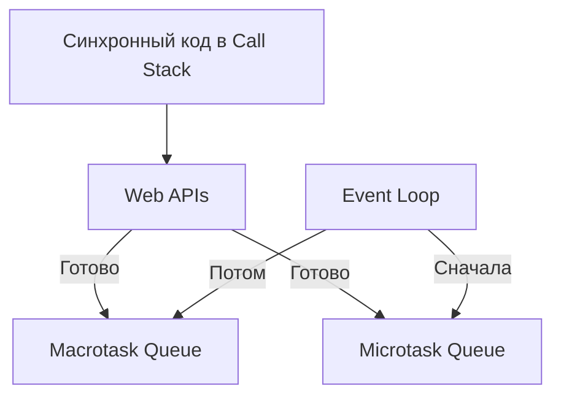

# Асинхронность - Event Loop

## Определение
**Event Loop** — это механизм в JavaScript, который управляет выполнением кода, обработкой событий и работой с очередями задач.  
Он позволяет асинхронным операциям выполняться без блокировки основного потока.

---

## Зачем нужен
- Контролирует порядок выполнения кода
- Обеспечивает работу асинхронности в однопоточном движке
- Обрабатывает задачи из **очередей** (macrotask и microtask)
- Позволяет браузеру или Node.js выполнять I/O операции "в фоне"

---

## Как работает
1. **Call Stack** (стек вызовов) — сюда попадает выполняемый код.
2. **Web APIs** (в браузере) или **C++ API** (в Node.js) обрабатывают асинхронные операции (таймеры, HTTP-запросы, события).
3. Готовые задачи отправляются в:
   - **Macrotask Queue** (setTimeout, setInterval, события)
   - **Microtask Queue** (Promise, queueMicrotask, MutationObserver)
4. **Event Loop** проверяет:
   - Если стек пуст, он сначала выполняет **все микрозадачи**
   - Затем берёт **одну макрозадачу** и выполняет её
5. Цикл повторяется бесконечно.

---

## Порядок выполнения
1. Выполнить весь синхронный код в стеке.
2. Выполнить **все** задачи из Microtask Queue.
3. Взять **одну** задачу из Macrotask Queue.
4. Повторить цикл.

---

## Пример

```js
console.log('Начало');

setTimeout(() => console.log('Macrotask: setTimeout'), 0);

Promise.resolve().then(() => console.log('Microtask: Promise'));

console.log('Конец');
```

**Результат в консоли:**

```
Начало
Конец
Microtask: Promise
Macrotask: setTimeout
```


---

## **Визуальная схема**



