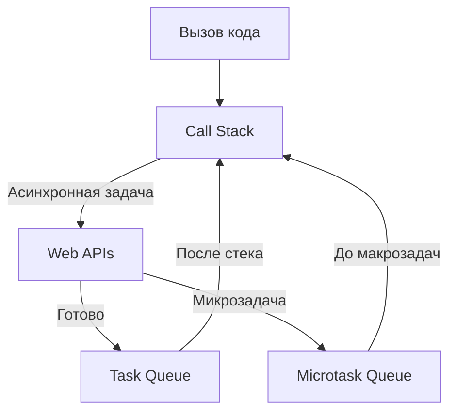
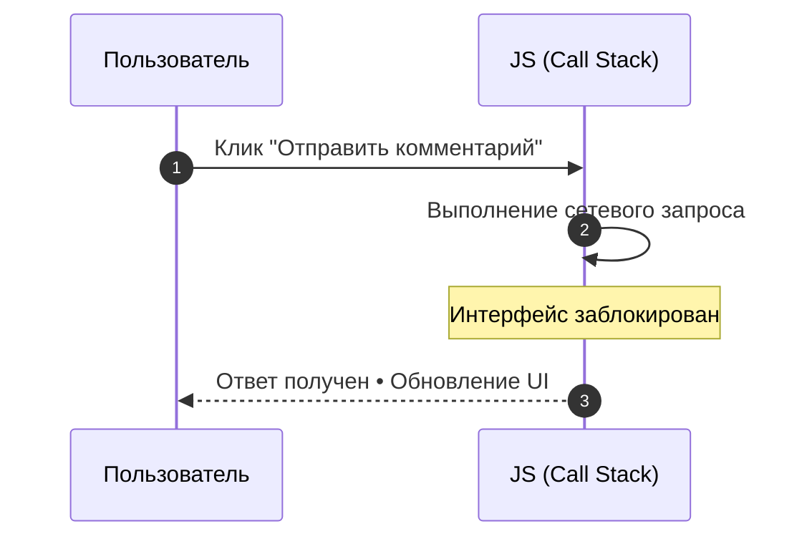
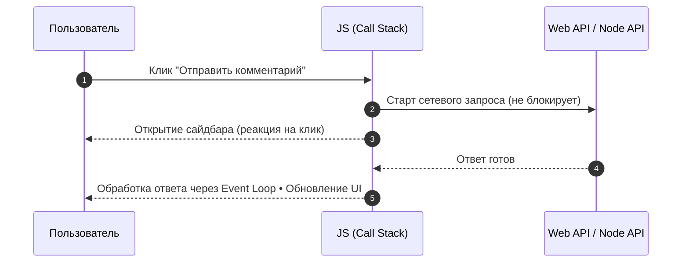
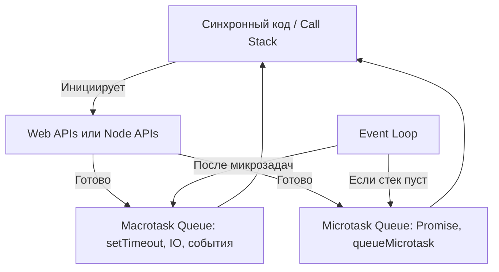

# Асинхронность в JavaScript

## Определение
Асинхронность — способ выполнять отложенные задачи без блокировки основного потока выполнения (JavaScript работает в однопоточном движке).

В асинхронной модели задачи могут выполняться "в фоне", пока основной код продолжает работу.

---

## Для чего используется
- Отложенное выполнение кода
- Обработка событий
- Таймеры и планирование задач
- Работа с сетевыми запросами (HTTP, WebSocket)
- Реакция на действия пользователя
- Работа с файлами, базами данных и API

---

## Как работает
1. **JavaScript однопоточен** — выполняет код поочерёдно.
2. **Асинхронность реализуется через Event Loop** — механизм, который управляет выполнением задач.
3. Асинхронный код попадает в **очереди задач**:
   - **Macrotask Queue** (основная очередь)
   - **Microtask Queue** (очередь микрозадач)
4. Код из очередей выполняется **после освобождения Call Stack** (стека вызовов).

---
## Основные инструменты

| 
Конспект
                  | Описание                                                      | Статус |
| ------------------------------------------ | ------------------------------------------------------------- | ------ |
| [[Асинхронность - Event Loop]]             | Управляет порядком выполнения синхронных и асинхронных задач. |        |
| [[Асинхронность - setTimeout]]             | Выполняет код с задержкой.                                    | ✅      |
| [[Асинхронность - setInterval]]            | Повторяет код через заданный интервал.                        | ✅      |
| [[Асинхронность - Promise]]                | Представляет результат асинхронной операции.                  | ✅      |
| [[Асинхронность - async await]]            | Упрощает работу с Promise в синхронном стиле.                 |        |
| [[Асинхронность - requestAnimationFrame]]  | Запускает код перед перерисовкой экрана.                      |        |
| [[Асинхронность - Microtask vs Macrotask]] | Делит задачи на микрозадачи и макрозадачи.                    |        |

---

## Ключевые понятия
- **Call Stack** — стек вызовов, в котором выполняется код.
- **Event Loop** — цикл событий, следящий за очередями задач.
- **Task Queue (Macrotask Queue)** — очередь макрозадач (таймеры, события, I/O).
- **Microtask Queue** — очередь микрозадач (Promise, queueMicrotask).

---

## Визуальная схема Event Loop

